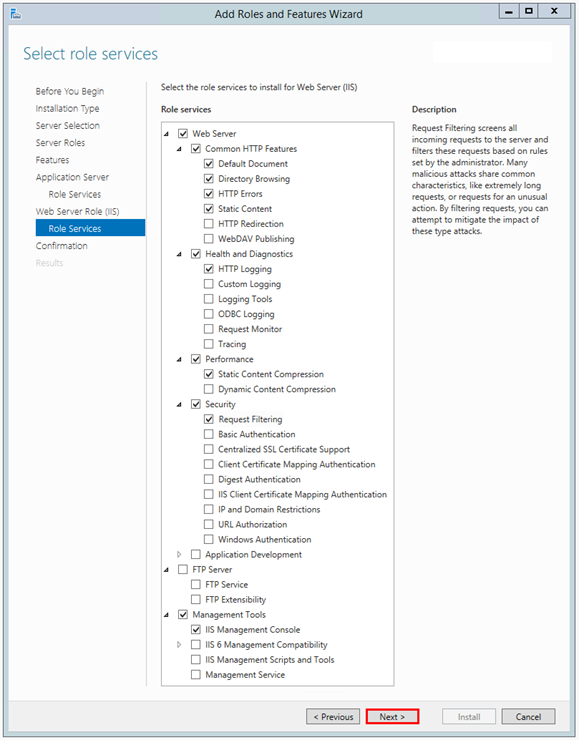
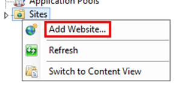
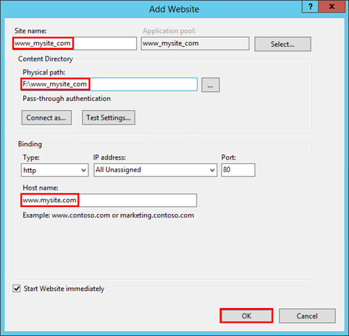
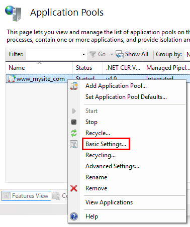
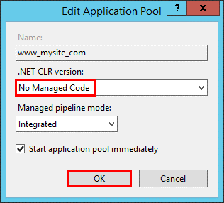

# Gym
- opis biznesowo-funkcjonalny
- opis do czego służy aplikacja
- instrukcja obsługi

Projekt ten zakład wypromowanie aplikacji webowej dostępnej na przeglądarkach internetowych zarówno dektopowych jak i mobilnych. Ważnym założeniem jest podjęcie współpracy z siłowniami oraz specjalistami takimi jak dietetyk bądź fizjoterapeuta, które dostarczyły by odpowiedniej wiedzy podczas budowania danej aplikacji. Aplikacja startuje od zera dla tego też zakres projektu dotyczy lokalnych siłowni i najbliższych okolic, nie wykluczamy jednak rozwoju na inne miasta . Chcemy również z czasem wykonać odpowiedniki naszej aplikacji w różnych językach co umożliwiło by nam to pojawienie się na rynku międzynarodowym.
Po przez promowanie zdrowego trybu życia u dzieci chcemy zwiększyć świadomość społeczeństwa o problemie jakim jest otyłość. Projekt ten obejmował by również specjalistów w dziedzinie zdrowego odżywiania gdyż aplikacja zamieszczała by lokalizację oraz kontakt do owych specjalistów. Klienci korzystający z naszej aplikacji otrzymywali by rabaty na dietę dla siebie oraz swoich dzieci bądź plany ćwiczeń sprecyzowanych pod jedną osobę. 

Instrukcja obsługi :
•	Aplikacja po odpaleniu wymaga od nas logowania.
•	Po wprowadzeniu danych zostanie sprawdzona baza danych czy dany użytkownik w niej już istnieje. ( jeśli nie będzie wymagane wypełnienie formularza /rejestracja ) 
•	Zalogowany użytkownik ma możliwość dodawać opinie pod siłowniami które są podpięte na naszej stronie 
•	Aplikacja ta daje również użytkownikowi możliwość sprawdzenia lokalizacji siłowni 

Gymapp

Buzinesowe
- Rejestracja i logowanie
- Dodawanie siłowni
- Opiniowanie siłowni
- Podgląd siłowni
- Podgląd lokalizacji siłowni - mapa

Technicznie:
- Wzorzec MVC
- Wykorzystanie bazy danych SQL Server localdb
- Entity Framework jako ORM do połączenia z baza
- DI dołączone do ASP.NET Core
- Bootstrap
- Google maps
- ASP.NET Core 3.1
- Razor

Karolina Ryznar
- Strona główna - uzupełnienie o kafelki aktualnie opiniowanych siłowni
- Przejście do podstrony siłowni
- Podstrona siłowni w raz z opiniami i mapa lokalizacji
- Dodawanie opinii - tylko dla zalogowanych użytkowników
- Strona do zgłoszenia siłowni do opiniowania
- Aktualizacja schematu bazy danych o modele reprezentujące tabele przechowujące informacje o siłowniach i ich opinii
- Aktualizacja bazy danych o przykładowo wpisane siłownie
- Walidacja dodawanych siłowni
- Walidacji dodawanych opinii
- Wyszukiwanie siłowni po nazwie
- Podgląd wyszukiwanych siłowni
- Stylizacja aplikacji
- Uzupełnienie o przykładowe siłownie 

Paweł Długosz
- założenie repozytorium
- utworzeni i konfiguracja bazy danych
- stworzenie systemu autentyfikacji użytkowników
- ograniczenie dostępu do stron wymagających logowania
- stworzenie modelu użytkowników
- utworzenie i stylizowanie ekranów logowania oraz rejestracji
- zapisywanie użytkowników do bazy
- szyfrowanie hasła metodą kryptograficzną
- walidacja danych
- sprawdzenie złożoności hasła
- wyświetlanie informacji o błędach

Tomasz Hajduga
- prowadzenie i koordynacja projektu
- przygotowanie dokumentacji technicznej
- przygotowanie dokumentacji biznesowej
- testy manualne aplikacji
- procedura budowania aplikacji na serwerze

Opis procedury pełnego zbudowania aplikacji 

Jako serwer wybraliśmy Windows Server 2020. Zatem do zrealesowania aplikacji potrzebujemy skonfigurowany Windows Server wraz usługami i rolami pozwalającymi na zarządzanie i hostowanie aplikacji napisanej w .NET Core.  

 
Screenshot 1. Podstawowe wymagane serwisy w systemie Windows Server
Serwer powinien mieć również zainstalowany  .NET Core Hosting Bundle w wersji 3.1. https://dotnet.microsoft.com/download/dotnet-core/3.1 pozwalający na hostowanie aplikacji na serwerze IIS. 		
Jeśli wszystko jest zainstalowane i serwer działa poprawnie można przejść do kolejnego kroku jakim jest przygotowanie aplikacji w IIS i upublikowanie jej na serwerze.
Do zbudowania aplikacji wykorzystamy komendy dostępne dotnet cli. 
To jest kolejno:
1.	dotnet restore
2.	dotnet build -c Release 
3.	dotnet publish -c Release -p:UseAppHost=false

Publikowanie odbywa się poprzez stworzony w aplikacj profil publikowania 
O nazwie UseAppHost, który publikuje aplikacje do wybranego przez nas katalogu wraz z odpowiednio skonfigurowanym SQL Server.
Do poprawnego działania potrzebujemy zainstalowanego SQL Serwera, a także SQL Management Studio. W tym celu pobieramy i instalujemy 
1.	SQL Server 2019 Express - https://www.microsoft.com/en-us/download/details.aspx?id=101064
2.	Oraz SQL Management Studio
https://docs.microsoft.com/en-us/sql/ssms/download-sql-server-management-studio-ssms?view=sql-server-ver15
Po uruchomieniu Panelu zarządania IIS kolejno dodajemy nowa strone

 
 
Screenshot 2. Dodanie aplikacji webowej do IIS

 

Screenshot 3. Utworzenie aplikacji webowej
Ustawiając lokalizacje do folderu gdzie zpublikowaliśmy aplikacje .NET-owa.
Należy również pamiętać o odpowiednim ustawieniu puli aplikacyjnej:

Screenshot 4. Konfiguracja app pool aplikacji
I wybranie jak poniżej 
 
 
 
 W Folderze screeny zamieszczone są również zdjęcia aplikacji.
